# Руководство пользователя «Mark»

**Система маркировки и учёта производства**
LDN Tech · © 2026 LDN Tech

---

## Содержание

1. [О программе](#о-программе)
2. [Главное окно](#главное-окно)
3. [Создание этикетки](#создание-этикетки)
   - [Шаг 1. Выбор продукта, цеха и изготовителя](#шаг-1-выбор-продукта-цеха-и-изготовителя)
   - [Шаг 2. Вес и количество](#шаг-2-вес-и-количество)
   - [Шаг 3. Размер этикетки](#шаг-3-размер-этикетки)
   - [Что попадает на этикетку](#что-попадает-на-этикетку)
   - [Шаг 4. Оформление текста](#шаг-4-оформление-текста)
   - [Шаг 5. Режим сдвига](#шаг-5-режим-сдвига)
   - [Шаг 6. Печать и количество копий](#шаг-6-печать-и-количество-копий)
   - [Изменение даты и времени на этикетке](#изменение-даты-и-времени-на-этикетке)
4. [История печати](#история-печати)
   - [Повторная печать из истории](#повторная-печать-из-истории)
   - [Полный архив на устройстве](#полный-архив-на-устройстве)
5. [Файлы данных (Excel)](#файлы-данных-excel)
   - [Структура файла Excel](#структура-файла-excel)
   - [Добавить файл](#добавить-файл)
   - [Активные файлы](#активные-файлы)
   - [Удалить файл](#удалить-файл)
   - [Обновить данные](#обновить-данные)
6. [Статистика](#статистика)
   - [Карточки-показатели](#карточки-показатели)
   - [Периоды](#периоды)
   - [Диаграммы](#диаграммы)
   - [Детализация продукта](#детализация-продукта)
   - [Импорт и экспорт](#импорт-и-экспорт)
   - [Экспорт в Excel](#экспорт-в-excel)
   - [Источники данных](#источники-данных)
   - [Печать отчётов](#печать-отчётов)
7. [Частые вопросы](#частые-вопросы)

---

## О программе

«Mark» — программа для печати этикеток на пищевую продукцию и учёта объёмов производства. Программа работает на обычном компьютере и на сенсорном производственном терминале.

Что умеет программа:

- печатать этикетки с продуктом, весом, датой, сроком годности, цехом и изготовителем;
- считывать вес прямо с электронных весов;
- хранить историю печати и повторять печать любой ранее напечатанной этикетки;
- вести статистику производства (за день, неделю, месяц или произвольный период);
- импортировать и экспортировать данные, печатать сводные отчёты на листе A4.

Данные о продуктах, изготовителях и цехах программа берёт из файлов Excel — их можно добавлять, включать и обновлять (см. раздел [Файлы данных](#файлы-данных-excel)).

---

## Главное окно

После запуска открывается главное окно. Оно разделено на три части: **панель ввода** слева, **предпросмотр этикетки** в центре и **история печати** справа. Вверху расположены панель оформления текста и кнопки управления файлами данных, а в правом верхнем углу — кнопка **«Статистика»**.

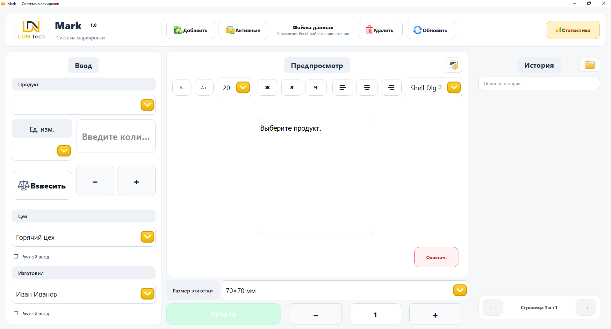

В верхней части окна над предпросмотром находится панель оформления текста этикетки.

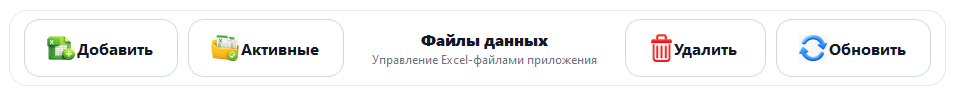

---

## Создание этикетки

Этикетка собирается в левой панели **«Ввод»** и сразу отображается в центральном окне предпросмотра. Порядок действий — ниже.

### Шаг 1. Выбор продукта, цеха и изготовителя

В поле **«Продукт»** выберите позицию из выпадающего списка. Список поддерживает поиск: начните вводить название — программа отфильтрует подходящие позиции.

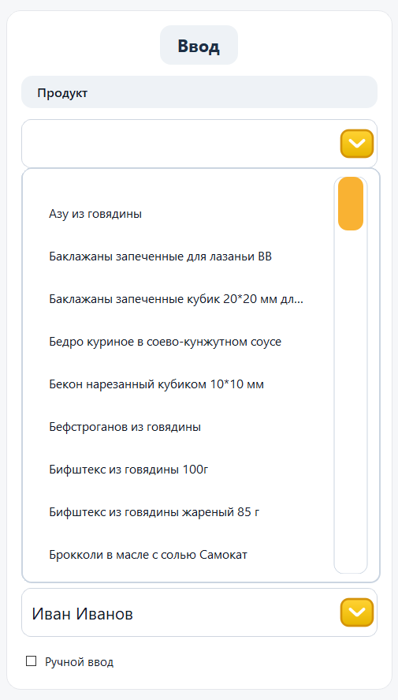

Ниже выбираются **цех** и **изготовитель**. Если в источнике данных указан только один цех (или один изготовитель), программа подставит его автоматически — выбирать вручную не придётся.

Если нужного значения в списке нет, поставьте галочку **«Ручной ввод»** под соответствующим полем — тогда цех или изготовителя можно вписать вручную.

### Шаг 2. Вес и количество

Блок под выбором продукта задаёт **вес или количество**, которое попадёт на этикетку в строку «Вес/шт».

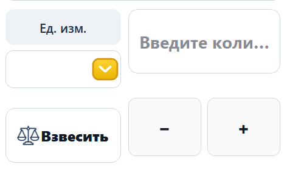

- **Ед. изм.** — единица измерения (кг, шт, порц). Доступные варианты берутся из источника данных для выбранного продукта.
- Поле **«Введите количество»** — значение можно ввести вручную, либо изменить кнопками **«−»** и **«+»**.
- **«Взвесить»** — считать вес напрямую с электронных весов. Программа сама находит подключённые по USB/COM-порту весы (поддерживаются Тензо-М и совместимые), считывает текущий вес и подставляет его в поле. Это удобно, когда продукт взвешивается прямо на рабочем месте.

### Шаг 3. Размер этикетки

Нажмите поле **«Размер этикетки»** и выберите нужный формат. Доступны:

- **58 × 80 мм**
- **58 × 60 мм**
- **70 × 70 мм**
- **Цветные** — формат для печати на цветной ленте.

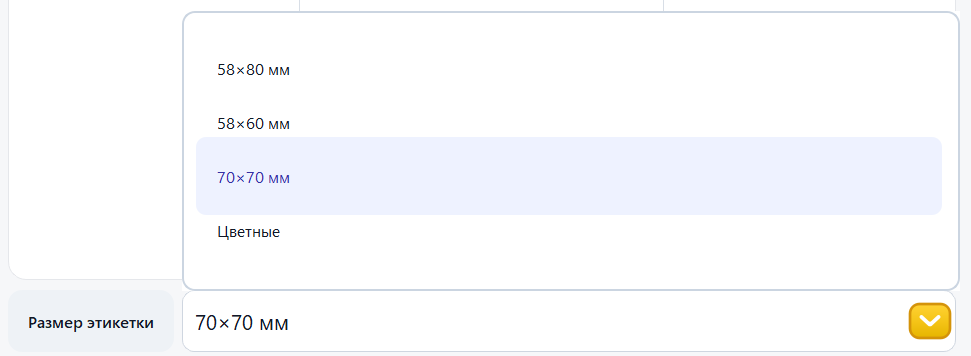

### Что попадает на этикетку

Содержимое этикетки формируется автоматически. Строки идут в следующем порядке:

- **День недели** — крупным шрифтом сверху (присутствует не на всех размерах);
- **Продукт** — название;
- **Вес / шт** — значение и единица измерения;
- **Дата / время** — момент печати;
- **№ партии** — в формате ДДММГГ (день-месяц-год). Например, `310526` — это 31 мая 2026 года;
- **Годен до** — время печати плюс срок годности продукта в часах (срок берётся из источника данных);
- **Цех**;
- **Изготовил**.

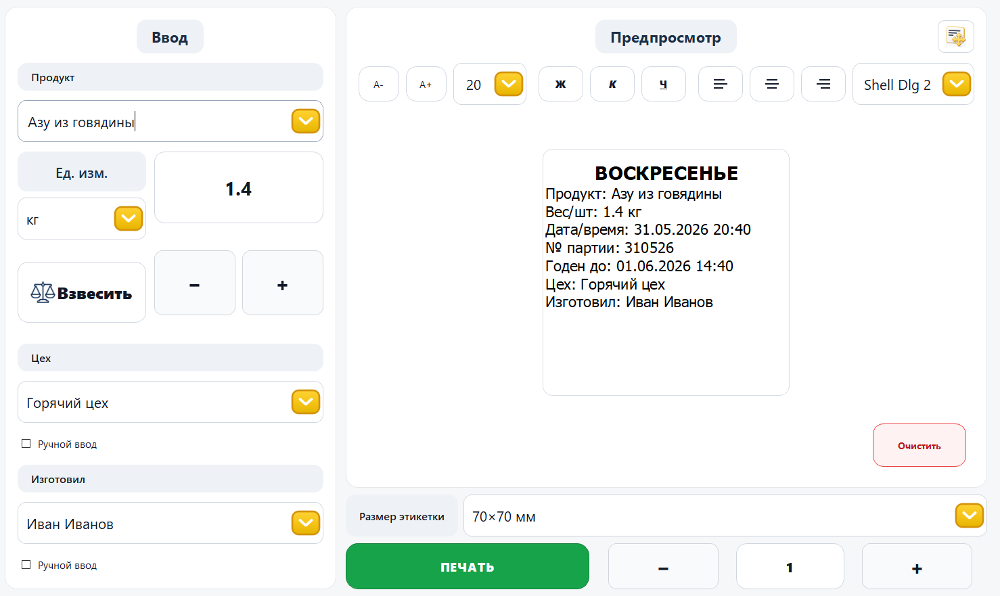

Для цветной ленты используется отдельный формат «Цветные».

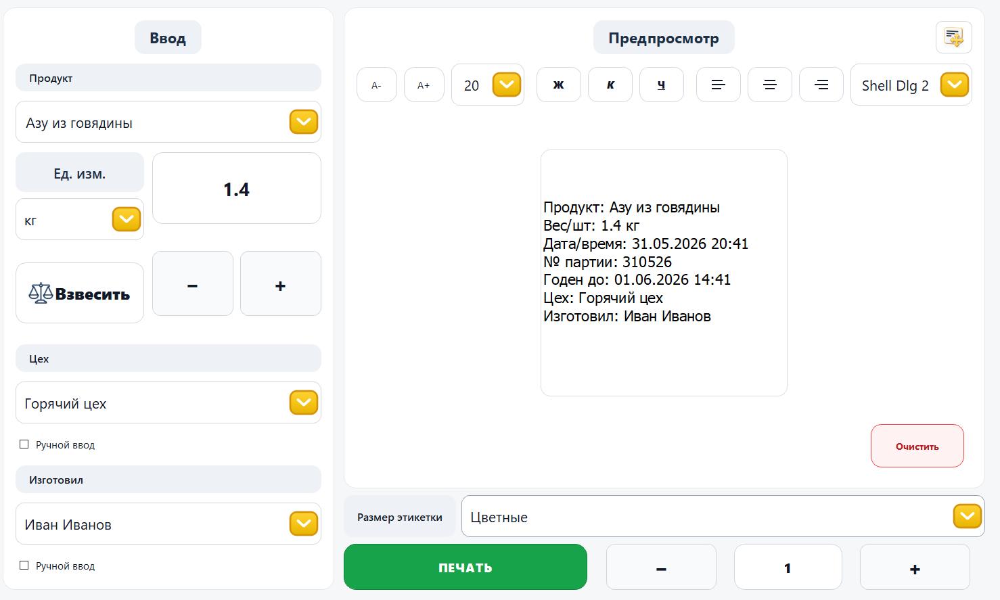

### Шаг 4. Оформление текста

Верхняя панель позволяет настроить вид текста на этикетке:

- **A−** и **A+** — уменьшить / увеличить размер шрифта;
- поле **размера шрифта** с выпадающим списком (9–22 и далее);
- **Ж**, **К**, **Ч** — полужирный, курсив, подчёркнутый;
- три кнопки **выравнивания** — по левому краю, по центру, по правому краю;
- поле **выбора шрифта**.

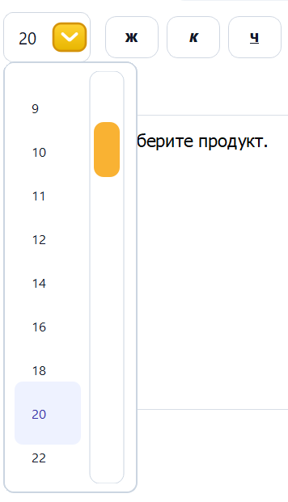

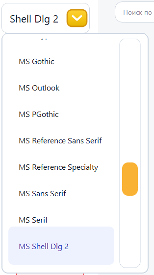

Все изменения сразу отображаются в центральном окне предпросмотра.

### Шаг 5. Режим сдвига

Если текст нужно немного сместить относительно стикера (например, подогнать под конкретную ленту), включите **режим сдвига** кнопкой в правом верхнем углу предпросмотра. Когда режим включён, кнопка подсвечивается жёлтым.

| Режим выключен | Режим включён |
|:---:|:---:|
|  |  |

В режиме сдвига текст можно перетаскивать мышью (или пальцем на терминале). Если часть текста выходит за границу стикера, она подсвечивается **красным** — это подсказка, что содержимое не поместится. Красная подсветка видна только в предпросмотре и на печать не влияет.

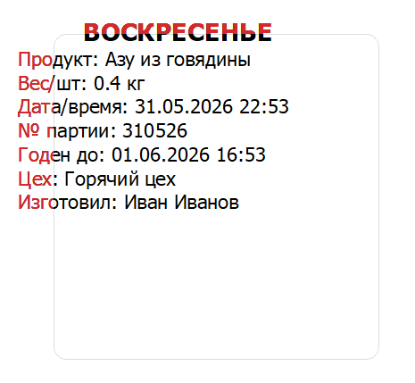

Повторное нажатие кнопки выключает режим и возвращает текст в исходное положение.

### Шаг 6. Печать и количество копий

Внизу укажите **число копий** кнопками **«−»** и **«+»** (по умолчанию — 1) и нажмите зелёную кнопку **«ПЕЧАТЬ»**. Кнопка **«Очистить»** убирает текущую этикетку из предпросмотра.

После печати этикетка автоматически попадает в **историю** (правая панель) и в архив на устройстве.

### Изменение даты и времени на этикетке

Обычно программа ставит на этикетку **текущие** дату и время. Если нужно напечатать этикетку другой датой или временем (например, оформить продукцию, изготовленную ранее), в программе есть отдельный режим редактирования.

Чтобы его включить, **дважды нажмите** на заголовок **«Предпросмотр»** над центральным окном. Заголовок сменится на фиолетовую плашку **«Редактирование»** — значит, режим включён.

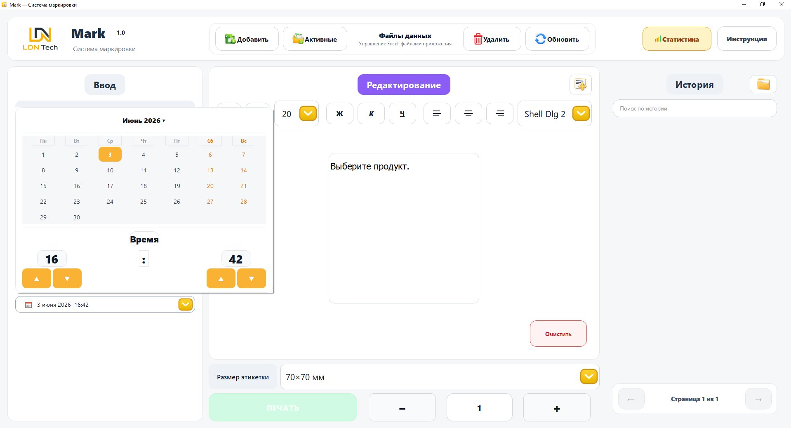

В этом режиме:

- в левой панели появляется поле **«Дата и время»**. Нажмите на него — откроется календарь с выбором даты и времени. Выбранные значения сразу подставляются в этикетку: пересчитываются строки **«Дата / время»**, **«№ партии»** (ДДММГГ) и **«Годен до»**;
- блоки **«Цех»** и **«Изготовил»** временно скрываются, чтобы не мешать;
- текст в окне предпросмотра становится **редактируемым** — при необходимости его можно поправить вручную.

Чтобы выйти из режима и вернуть текущие дату и время, **снова дважды нажмите** на заголовок — плашка вернётся к надписи «Предпросмотр».

---

## История печати

Правая панель **«История»** показывает последние напечатанные этикетки. Для каждой записи видны: название продукта, вес/количество, изготовитель и цех, дата и время, а также № партии. Над списком есть поле **«Поиск по истории»**, а внизу — постраничная навигация (стрелки «назад» / «вперёд» и номер страницы).

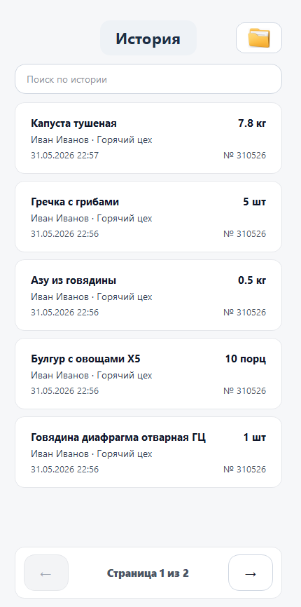

### Повторная печать из истории

Чтобы напечатать этикетку повторно, **нажмите на нужную запись** в истории. Запись выделится рамкой, а её этикетка загрузится в центральное окно предпросмотра — останется только указать число копий и нажать **«ПЕЧАТЬ»**.

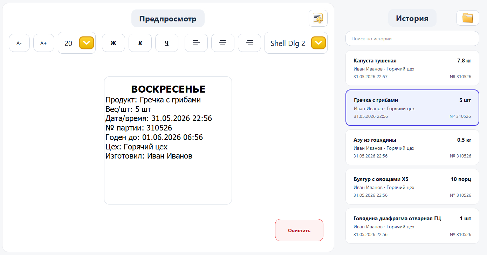

### Полный архив на устройстве

Кнопка-папка в правом верхнем углу панели «История» открывает **полный архив этикеток** на устройстве в Проводнике Windows.

Архив организован по годам и месяцам. Сначала открывается папка года, внутри неё — папки месяцев (например, «05 — Май»), а внутри месяца — папки по дням (формат ДД.ММ.ГГГГ).

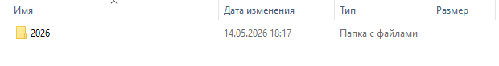

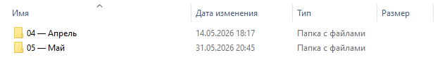

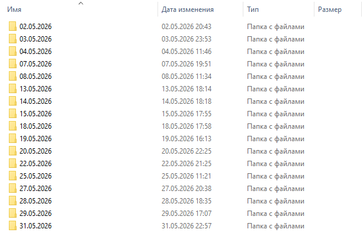

Внутри папки дня лежат текстовые файлы — по одному на каждую напечатанную этикетку.

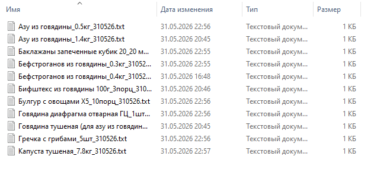

В каждом файле сохранён полный текст этикетки и количество напечатанных копий.

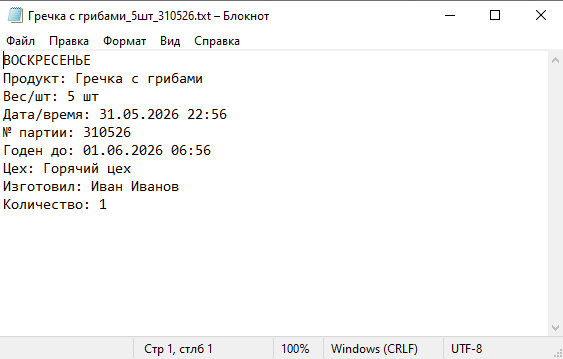

---

## Файлы данных (Excel)

Продукты, изготовителей и цеха программа читает из файлов Excel. Управление этими файлами собрано в группе **«Файлы данных»** в верхней части главного окна: четыре кнопки — **Добавить**, **Активные**, **Удалить** и **Обновить**.

- **Добавить** — подключить к программе новый Excel-файл.
- **Активные** — выбрать, какие из добавленных файлов сейчас используются.
- **Удалить** — убрать файл из списка программы (с диска файл не стирается).
- **Обновить** — перечитать данные из активных файлов.

### Структура файла Excel

Чтобы файл подошёл программе, он должен содержать **три листа** с точными названиями: **«продукт»**, **«изготовил»** и **«цех»**. В каждом листе первая строка — заголовки колонок, а данные начинаются со второй строки.

Лист **«продукт»** — перечень продукции:

| Колонка | Назначение |
|---|---|
| Код | Внутренний код продукта |
| Наименование | Название, как оно попадёт на этикетку |
| Срок годности (ч) | Срок годности в часах — из него считается строка «Годен до» |
| Ед. измер. | Единицы измерения через запятую: `кг`, `шт` или `кг,шт` |
| Активен | `Да` или `1` — показывать; `Нет` или `0` — скрыть из списка |
| Комментарий | Произвольная заметка (необязательно) |

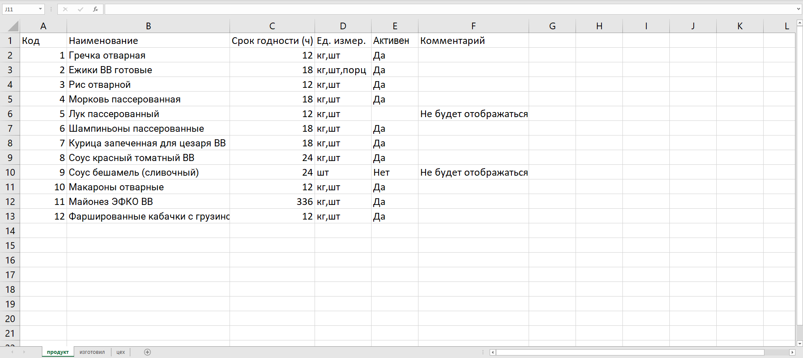

Лист **«изготовил»** — список сотрудников:

| Колонка | Назначение |
|---|---|
| ФИО | Имя сотрудника |
| Активен | `Да`/`1` — показывать; `Нет`/`0` — скрыть |

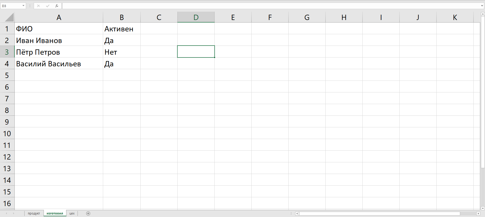

Лист **«цех»** — список цехов:

| Колонка | Назначение |
|---|---|
| Цех | Название цеха |
| Активен | `Да`/`1` — показывать; `Нет`/`0` — скрыть |

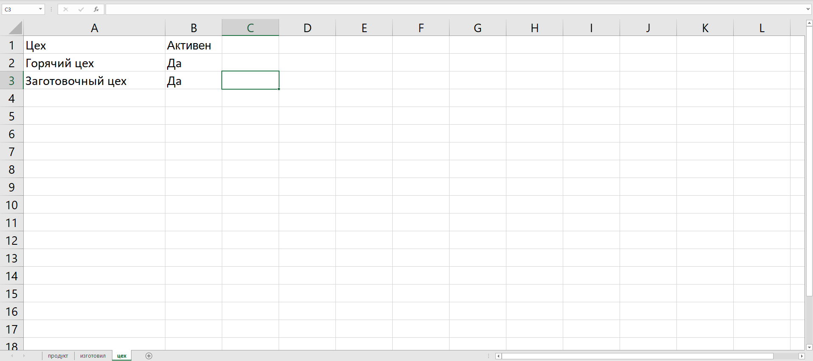

> Если в листе «изготовил» или «цех» осталась только одна активная запись, программа подставит её автоматически — работнику не придётся выбирать её при каждой печати.

### Добавить файл

Нажмите **«Добавить»**. Сначала откроется окно-подсказка **«Структура файла Excel»** с описанием требуемых листов и колонок. Ознакомьтесь и нажмите **«Выбрать файл»** (или «Отмена», чтобы выйти).

Затем выберите файл (`.xlsx` или `.xlsm`). Программа проверит, что в нём есть все три обязательных листа:

- если листов не хватает — появится предупреждение, и файл не будет добавлен;
- если такой файл уже подключён — программа сообщит об этом;
- если всё в порядке — файл добавится в список и сразу станет **активным**. Появится подсказка нажать **«Обновить»**, чтобы программа перечитала данные.

### Активные файлы

Кнопка **«Активные»** открывает окно **«Активные Excel-файлы»** со списком всех добавленных файлов и галочками. Отметьте галочками те файлы, которые программа должна использовать, и нажмите **«Сохранить»**. Если файл отмечен, но не найден на диске, рядом будет пометка «файл не найден на диске».

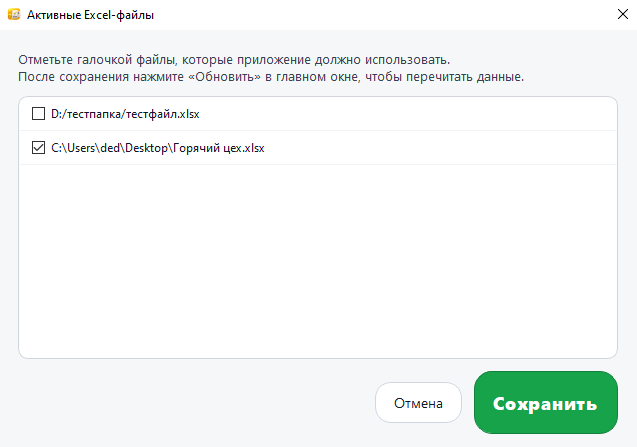

Можно держать активными **несколько файлов одновременно** — тогда продукты, изготовители и цеха из всех активных файлов объединяются в общие списки. После изменения галочек нажмите **«Обновить»** в главном окне.

### Удалить файл

Кнопка **«Удалить»** открывает окно **«Удалить Excel-файл из списка»**. Выберите файл и нажмите **«Удалить из списка»**, затем подтвердите действие.

Важно: удаление убирает файл **только из списка программы**. Сам файл на диске остаётся нетронутым — при необходимости его можно добавить снова.

### Обновить данные

Кнопка **«Обновить»** заставляет программу заново перечитать все активные Excel-файлы — например, после того как вы поправили продукт или добавили новую позицию в файл. Если активных файлов нет, программа подскажет добавить файл и включить его в «Активные».

Кроме ручного обновления, программа **сама перечитывает активные файлы примерно раз в минуту** в фоновом режиме, поэтому небольшие правки в Excel подхватываются автоматически.

> **Общий файл в сетевой папке.** Файл-источник можно разместить в общей сетевой папке (на сервере или сетевом диске) и подключить его кнопкой **«Добавить»** на каждом устройстве. Тогда данные достаточно вести в одном файле: благодаря автоматическому обновлению правки подхватятся на всех компьютерах и терминалах примерно в течение минуты — отдельно обновлять каждое рабочее место не нужно.

---

## Статистика

Чтобы перейти к статистике, нажмите кнопку **«Статистика»** в правом верхнем углу главного окна. Вернуться к печати можно кнопкой **«Вернуться в режим печати»**, а к началу раздела статистики — кнопкой **«Вернуться на главную статистику»**.

### Карточки-показатели

Вверху отображаются четыре карточки за выбранный период:

| Карточка | Что показывает |
|---|---|
| Этикеток | Сколько наклеек напечатано |
| Операций | Сколько раз нажимали «ПЕЧАТЬ» |
| Дневная смена | Этикеток, напечатанных в дневную смену (08:00–19:59) |
| Ночная смена | Этикеток, напечатанных в ночную смену (20:00–07:59) |

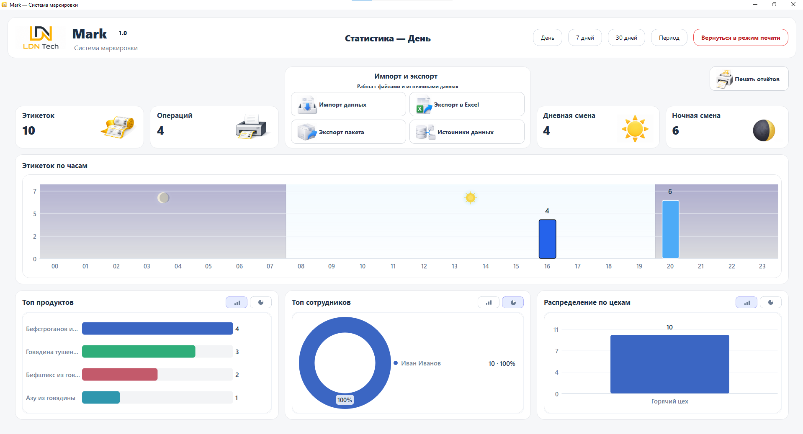

### Периоды

Период переключается кнопками: **День**, **7 дней**, **30 дней** и **Период**.

При выборе **«День»** показывается распределение по часам суток; ночные часы на графике затемнены, чтобы дневную и ночную смены было видно сразу.

Кнопка **«Период»** открывает окно выбора произвольного диапазона дат. Задайте начало и конец, при необходимости — время; внизу окна показывается итог («Выбрано: … ч»). Нажмите **«Применить»** для подтверждения или **«Отмена»** для выхода.

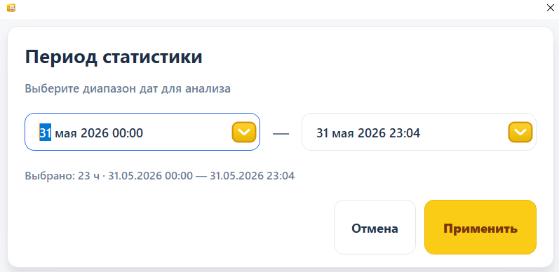

### Диаграммы

Под карточками выводятся диаграммы по выбранному периоду: динамика, топ продуктов, топ сотрудников и распределение по цехам. У диаграмм есть переключатель вида — **столбцы** или **кольцо**.

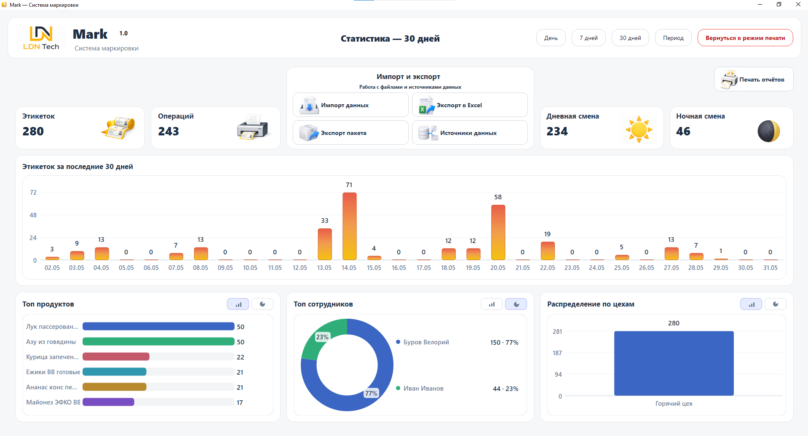

### Детализация продукта

При выборе отдельного продукта открывается его детальная статистика. Доступны два представления — **гистограмма** и **диаграмма**.

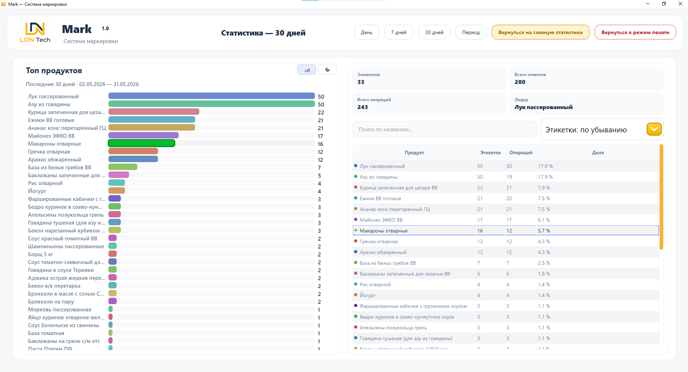

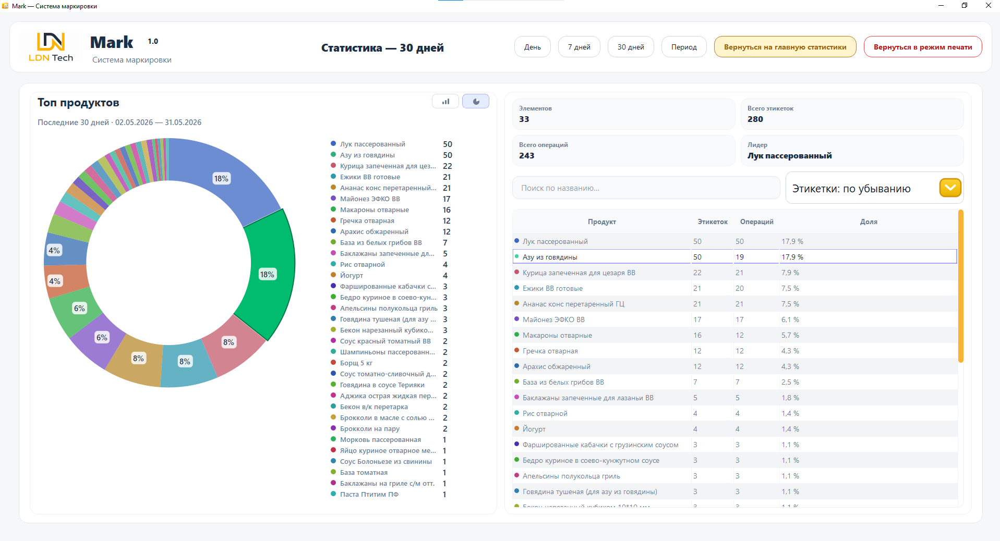

### Импорт и экспорт

Блок **«Импорт и экспорт»** объединяет работу с файлами и источниками данных.

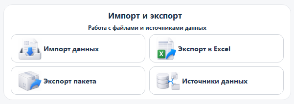

Доступны четыре действия:

- **Импорт данных** — загрузить ранее сохранённый пакет статистики (например, перенесённый с другого устройства);
- **Экспорт в Excel** — выгрузить статистику в таблицу Excel;
- **Экспорт пакета** — сохранить данные пакетом для переноса на другое устройство;
- **Источники данных** — список импортированных пакетов.

### Экспорт в Excel

Кнопка **«Экспорт в Excel»** выгружает всю статистику за выбранный период в одну книгу Excel (`.xlsx`). Имя файла содержит метки периода выгрузки, поэтому файлы за разные периоды не перезаписывают друг друга. Книга состоит из **шести листов** (вкладки внизу окна Excel): Сводка, По дням, Топ продуктов, Топ сотрудников, По цехам и Сырые записи.

#### Ключевые понятия

Чтобы правильно читать цифры, важно различать три величины — они используются на всех листах:

- **Операция** — одно нажатие кнопки «ПЕЧАТЬ». Одна операция = одна строка на листе «Сырые записи».
- **Этикеток** — суммарное число фактически напечатанных наклеек. За одну операцию можно напечатать несколько копий, поэтому этикеток обычно больше, чем операций. По сути это сумма столбца «Копий».
- **Доля %** — доля позиции в общем числе этикеток за период.

> Пример: за период было 11 операций и 17 этикеток. Значит, в среднем за одно нажатие «ПЕЧАТЬ» выходило по 1–2 копии.

#### Лист «Сводка»

Итоговые показатели за период — в две колонки (название показателя и его значение).

| Показатель | Что означает |
|---|---|
| Период отчёта | Начало и конец выбранного диапазона дат и времени |
| Всего этикеток | Сколько наклеек напечатано за период |
| Всего операций | Сколько раз нажимали «ПЕЧАТЬ» |
| Дневная смена (сегодня) | Этикеток за сегодня в дневную смену |
| Ночная смена (сегодня) | Этикеток за сегодня в ночную смену |
| Уникальных продуктов | Сколько разных продуктов встречалось |
| Уникальных сотрудников | Сколько разных изготовителей |
| Уникальных цехов | Сколько разных цехов |

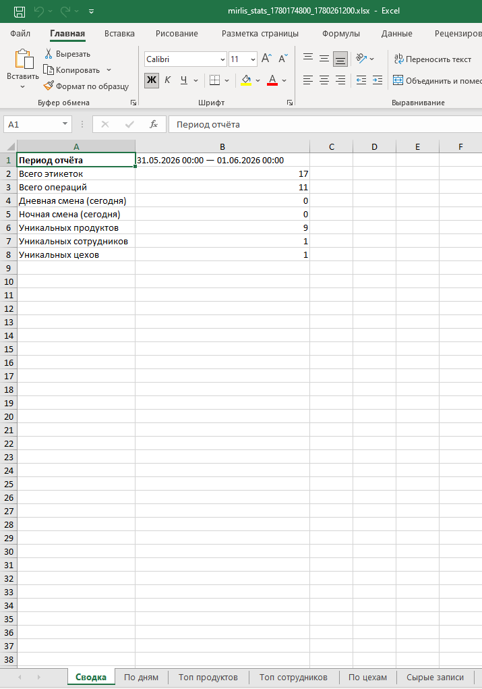

#### Лист «По дням»

Разбивка по датам — по строке на каждый день периода. Удобно строить график динамики.

| Столбец | Что означает |
|---|---|
| Дата | День (ДД.ММ.ГГГГ) |
| Этикеток | Напечатано наклеек за этот день |
| Операций | Число нажатий «ПЕЧАТЬ» за этот день |

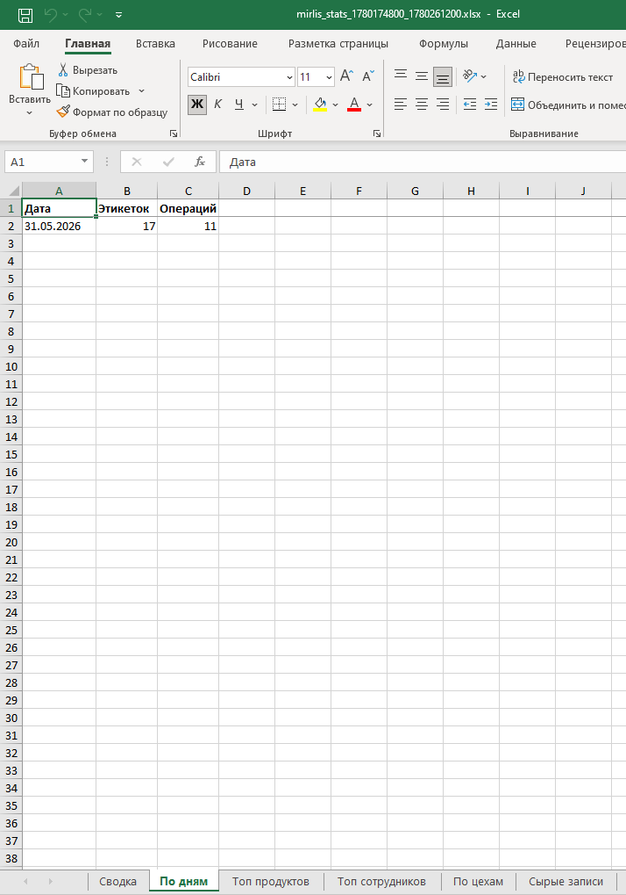

#### Лист «Топ продуктов»

Все продукты за период, отсортированные по убыванию числа этикеток.

| Столбец | Что означает |
|---|---|
| Продукт | Название продукта |
| Этикеток | Сколько наклеек этого продукта напечатано |
| Операций | Сколько раз печатали этот продукт |
| Доля % | Доля продукта в общем числе этикеток |

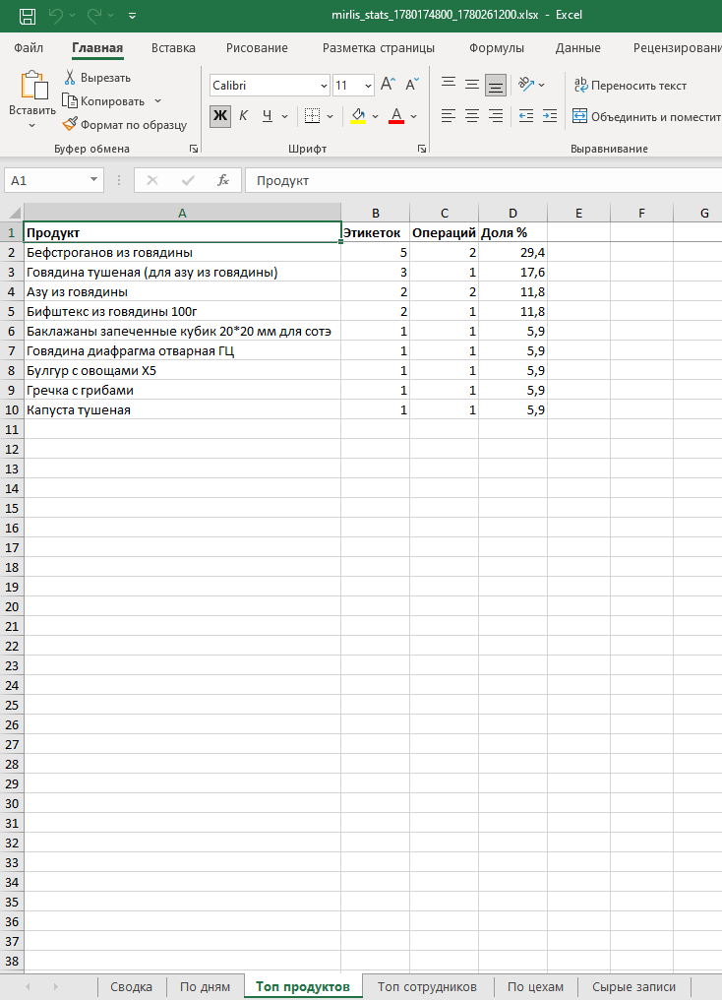

#### Лист «Топ сотрудников»

То же, но в разрезе изготовителей — кто сколько напечатал.

| Столбец | Что означает |
|---|---|
| Сотрудник | Изготовитель |
| Этикеток | Напечатано наклеек этим сотрудником |
| Операций | Число нажатий «ПЕЧАТЬ» |
| Доля % | Доля сотрудника в общем числе этикеток |

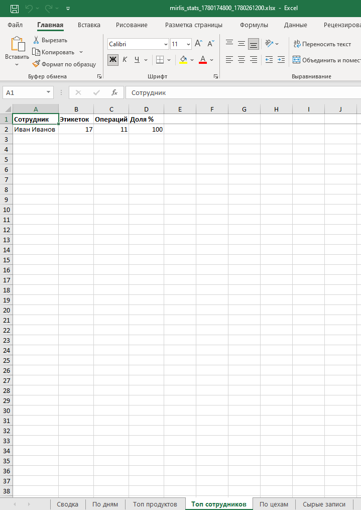

#### Лист «По цехам»

Разрез по цехам — где сколько напечатано.

| Столбец | Что означает |
|---|---|
| Цех | Название цеха |
| Этикеток | Напечатано наклеек в этом цехе |
| Операций | Число нажатий «ПЕЧАТЬ» |
| Доля % | Доля цеха в общем числе этикеток |

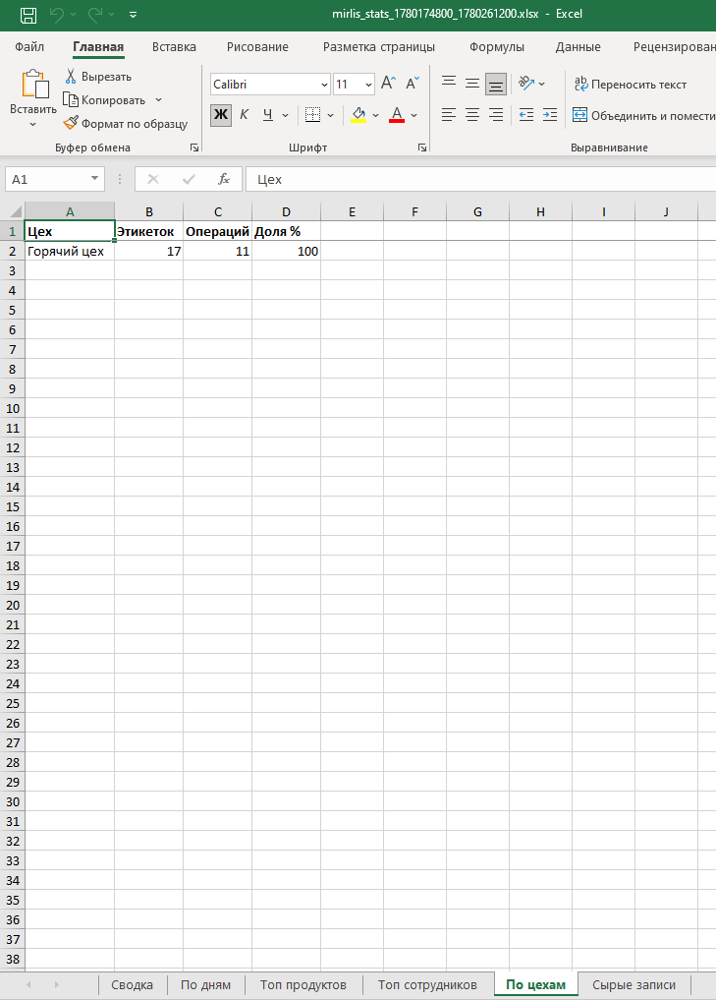

#### Лист «Сырые записи»

Полный «журнал» — по строке на каждую операцию печати, со всеми подробностями. Это исходные данные, из которых построены все остальные листы; на их основе можно делать собственные сводные таблицы.

| Столбец | Что означает |
|---|---|
| Дата/время | Точный момент печати (с секундами) |
| Продукт | Название продукта |
| Количество | Вес или число штук в одной этикетке |
| Ед. | Единица измерения (кг, шт, порц) |
| Изготовил | Кто печатал |
| Цех / Проверил | Цех (и, при наличии, кто проверил) |
| Партия | Номер партии в формате ДДММГГ |
| Копий | Сколько копий напечатано в этой операции |
| station_label | Имя устройства (ПК или терминала), где напечатано |
| station_uuid | Уникальный код этого устройства |
| record_id | Уникальный код записи |

Три последних столбца (`station_label`, `station_uuid`, `record_id`) — технические. Они нужны, чтобы при импорте пакетов с разных устройств записи не дублировались и было видно, на каком устройстве сделана печать. В повседневной работе их можно не учитывать.

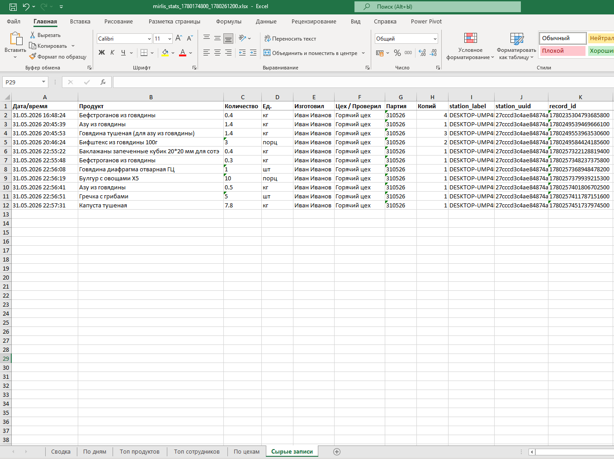

### Источники данных

Кнопка **«Источники данных»** открывает список импортированных пакетов статистики. Для каждого источника видны: имя файла, компьютер-источник, охваченный период (с и по), число записей и дата импорта. Лишний источник можно убрать кнопкой **«Удалить»**, а закрыть окно — кнопкой **«Закрыть»**.

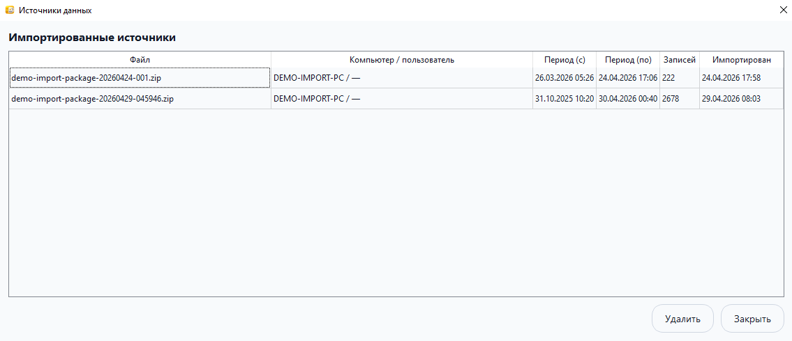

### Печать отчётов

Кнопка **«Печать отчётов»** формирует сводный отчёт на листе A4.

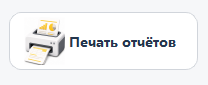

Откроется окно настроек отчёта. Здесь выбирается:

- **Состав отчёта** — какие блоки включить: Топ продуктов, Топ сотрудников, Распределение по цехам (для каждого можно выбрать вид диаграммы — столбцы или кольцо), а также Этикеток за период и Сводка;
- **Формат** — «Только значения» (без диаграмм, компактнее) или «Графики и значения» (с диаграммами);
- **Ориентация** — Книжная или Альбомная.

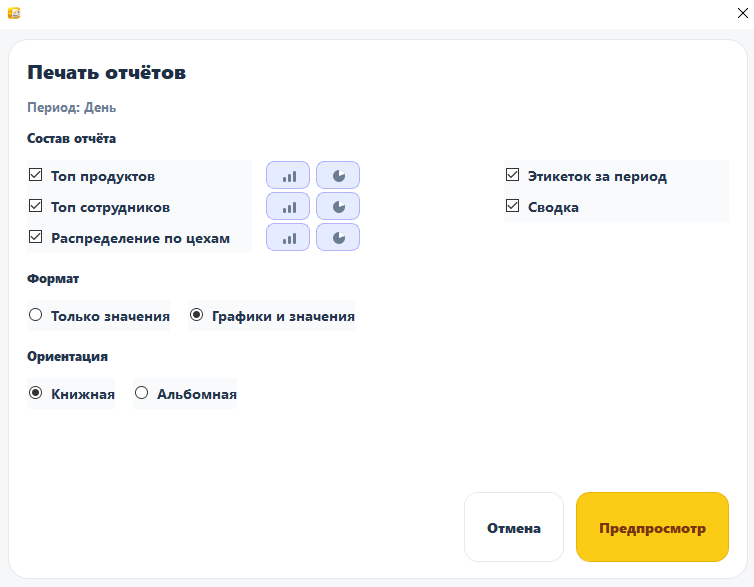

Кнопка **«Предпросмотр»** показывает готовый отчёт постранично перед печатью. В шапке каждой страницы — заголовок «Отчёт по статистике», период и номер страницы. Отчёт начинается со сводки и динамики (для периода «День» — по часам, иначе по дням)…

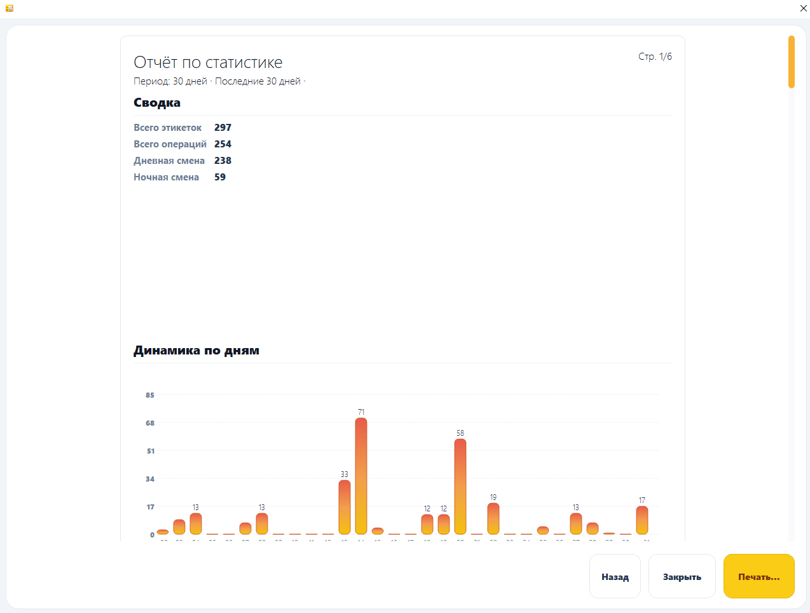

…далее идут топ продуктов в виде круговой диаграммы…

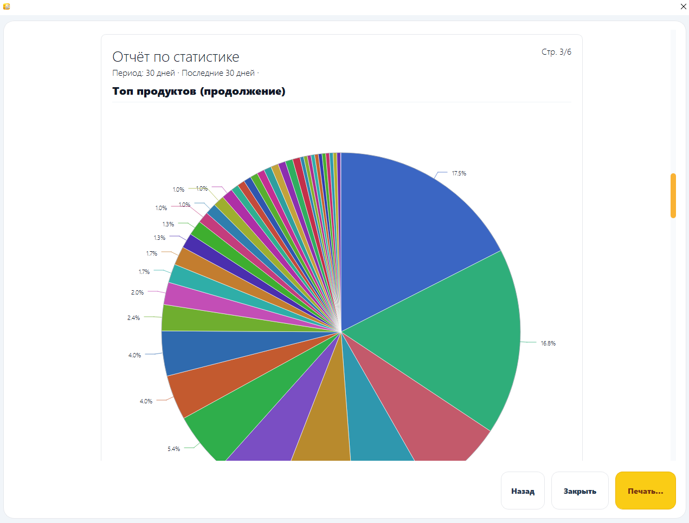

…и список топа продуктов с топом сотрудников.

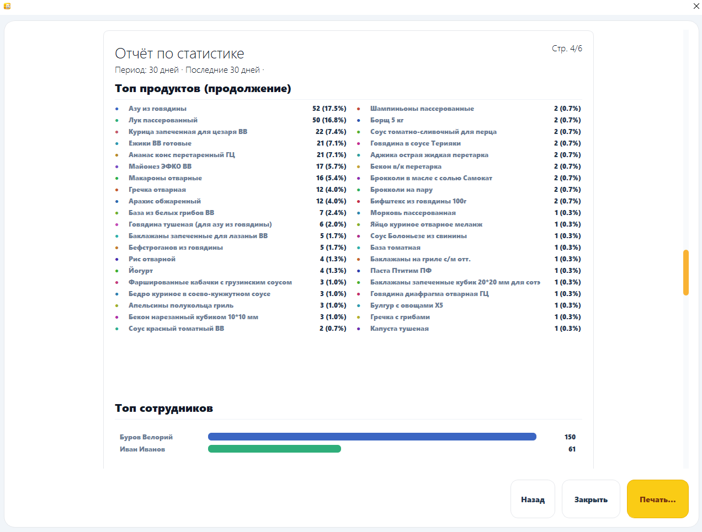

Кнопки **«Назад»**, **«Закрыть»** и **«Печать…»** управляют просмотром и отправкой на принтер.

---

## Частые вопросы

**На этикетке нет дня недели.**
День недели печатается не на всех размерах этикеток — это нормально для некоторых форматов.

**Часть текста подсвечена красным.**
Это режим сдвига: красным помечается то, что выходит за границу стикера. Уменьшите размер шрифта или сдвиньте текст. На печать красная подсветка не попадает.

**Нужного продукта, цеха или изготовителя нет в списке.**
Проверьте, добавлен ли нужный Excel-файл и включён ли он в «Активные», и нажмите «Обновить». Либо воспользуйтесь галочкой «Ручной ввод».

**Добавил файл, но данные не появились.**
После добавления или изменения файла нажмите «Обновить» в главном окне. Убедитесь также, что файл отмечен в окне «Активные».

**«Взвесить» не считывает вес.**
Проверьте, что весы включены и подключены к устройству по USB/COM-кабелю. Программа сама ищет порт; если весов несколько или порт «не тот», обратитесь к администратору для настройки.

**Нужно напечатать этикетку другой датой или временем.**
Дважды нажмите на заголовок «Предпросмотр» — включится режим «Редактирование» с полем выбора даты и времени (см. [Изменение даты и времени на этикетке](#изменение-даты-и-времени-на-этикетке)). Чтобы вернуть текущую дату, дважды нажмите на заголовок ещё раз.

**Как напечатать ту же этикетку ещё раз.**
Нажмите запись в панели «История» — этикетка вернётся в предпросмотр, после чего нажмите «ПЕЧАТЬ».

---

*LDN Tech · © 2026 LDN Tech*
